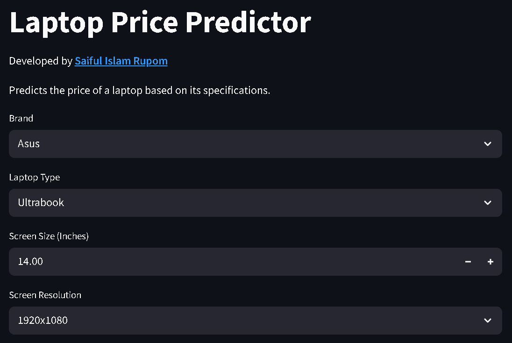

# Laptop Price Predictor using Machine Learning
**Live App**: [Click to Try the App](https://saiful-islam-rupom-laptop-price-predictor.streamlit.app/)

## Project Overview
This project is an interactive web application that predicts the price of a laptop based on its specifications using a regression-based machine learning model. It is powered by Random Forest Regressor and deployed using Streamlit Cloud for public access.

## Objective
The main objective of this project is to:
- Build a machine learning model that can **predict the price of a laptop** using its hardware specifications and brand details.
- Create an **interactive and user-friendly web app** that allows users to explore pricing predictions in real-time.
- Provide **currency conversion functionality** with customizable exchange rates.
- **Deploy the app online** for anyone to use without requiring any installations or technical expertise.

## Project Highlights
- Real-time prediction of laptop prices
- Built with a **Random Forest Regressor**
- Interactive Streamlit UI
- Editable currency exchange rates (INR ➝ USD, EUR, BDT)
- User input validation and dynamic dropdowns
- Deployed online using **Streamlit Community Cloud**

## Project Workflow
This project follows a complete end-to-end machine learning pipeline:
1. **Data Collection**
   - Real-world laptop specifications and prices were collected from online sources.
2. **Data Preprocessing**
   - Handling missing values
   - Feature engineering 
   - Encoding categorical variables
3. **Model Building**
   - Algorithm used: `RandomForestRegressor`
   - Trained on 85% of the dataset
   - Evaluated using MAE and R² score on test data
4. **Model Serialization**
   - Final pipeline (preprocessing + model) saved using `pickle` as `pipe.pkl`
   - Supporting data (e.g., dropdown options) saved as `df.pkl`
5. **Web App Development**
   - Built using **Streamlit** for fast deployment and easy UI
   - Inputs collected using dropdowns, sliders, checkboxes
   - Currency conversion with editable exchange rates (INR → USD, EUR, BDT)
6. **Deployment**
   - App deployed for free using **Streamlit Community Cloud**
   - Publicly accessible via shareable URL

## Machine Learning Overview
- **Problem Type:** Supervised Regression
- **Algorithm:** Random Forest Regressor. A powerful ensemble learning algorithm that combines multiple decision trees to reduce overfitting and increase generalization.
- **Target Variable:** Laptop Price (INR)
- **Evaluation Metrics:** R² Score, MAE

### Key Features Used:
- Brand
- Laptop Type (Ultrabook, Notebook, Gaming, etc.)
- Screen Size (inches)
- Screen Resolution (e.g., 1920x1080)
- IPS Panel (Yes/No)
- CPU
- RAM (GB)
- SSD + HDD Storage (GB)
- GPU
- Touchscreen (Yes/No)
- Operating System
- Weight

## Tech Stack

| Layer           | Tools Used                           |
|-----------------|--------------------------------------|
| Data Handling   | Pandas, NumPy                        |
| Data Visualizing| Matplotlib, Seaborn                  |
| ML Model        | Scikit-learn (RandomForestRegressor) |
| Model Storage   | Pickle (`pipe.pkl`, `df.pkl`)        |
| Web App         | Streamlit                            |
| Deployment      | Streamlit Community Cloud            |

## App Snapshot

## Future Enhancements
- Add live exchange rate integration using a currency API
- Show price distribution or comparison graph for selected specs
- Add data visualization dashboard (e.g., brand-wise price trends)
- Enable user uploads to batch-predict multiple laptops
- Enhance UI with theme customization and responsiveness

## License
This project is licensed under the [Apache-2.0 License](LICENSE)

## Author
- [Saiful Islam Rupom](https://www.linkedin.com/in/saiful-islam-rupom/)
- Email: [saifulislam558855@gmail.com]
